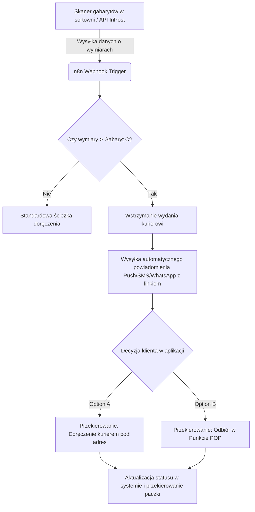

# Process Automation Case Study
**Role:** Process Automation Designer  
**Project:** Automatyzacja obsługi wyjątku przekroczenia gabarytu przesyłki (Over-dimension Exception Handling)  

---

## 1. Problem Statement & Context
W procesie logistycznym zdarzają się przypadki, gdy przesyłka zaadresowana do Paczkomatu® przekracza maksymalne dopuszczalne wymiary (np. skrytka Gabaryt C). Przyczyną mogą być błędne dane wprowadzone przez nadawcę, zmiana opakowania zbiorczego lub błąd integracji API po stronie e-commerce.

**Stan obecny (As-Is):**
* Paczka z błędnymi gabarytami przechodzi przez sortownię i trafia do auta kuriera.
* Kurier na miejscu pod Paczkomatem odkrywa brak możliwości umieszczenia przesyłki w skrytce.
* Kurier traci czas na bezpośredni kontakt telefoniczny z klientem lub zwraca paczkę do oddziału.
* **Marnotrawstwo:** Koszt paliwa, strata czasu pracy kuriera, opóźnienia w doręczeniach innych paczek, niski wskaźnik Customer Experience (NPS).

---

## 2. Proposed Solution (To-Be Workflow)
Wdrożenie automatycznego przepływu danych (**Dimension Exception Workflow**) z wykorzystaniem platformy Low-Code (np. n8n) połączonej z API InPost oraz systemami powiadomień.

### Analiza SWOT rozwiązania

| Mocne strony (Strengths) | Słabe strony (Weaknesses) |
| :--- | :--- |
| • Eliminacja niepotrzebnych kursów kuriera • Automatyczna komunikacja w czasie rzeczywistym • Szybkie wdrożenie dzięki architekturze Low-Code (n8n) | • Zależność od dokładności skanowania na sortowni • Konieczność reakcji klienta na powiadomienie |
| **Szanse (Opportunities)** | **Zagrożenia (Threats)** |
| • Wzrost wskaźnika NPS (klient sam decyduje o paczce) • Odciążenie infolinii i doręczycieli • Możliwość ponownego wykorzystania workflow dla innych wyjątków | • Opóźnienie decyzji klienta wydłużające czas magazynowania |

---

## 3. Business Case & Return on Investment (ROI)

*Uwaga: Poniższe wyliczenia opierają się na szacunkowych założeniach operacyjnych na potrzeby zadania.*

### 1. Obecnie ponoszone koszty (Stan As-Is)
* **Koszt pojedynczego wyjątku:** ~15 PLN (nieefektywny czas pracy kuriera pod Paczkomatem, próba załadunku, obsługa telefoniczna z klientem oraz logistyka zwrotna przesyłki na magazyn).
* **Miesięczny koszt błędów:** ~15 000 PLN / miesiąc (1 000 przypadków przekroczenia gabarytu w skali kraju × 15 PLN).

### 2. Koszty wdrożenia rozwiązania (Stan To-Be)
* **Jednorazowy koszt wdrożenia (CAPEX):** ~6 000 PLN (zaprojektowanie, konfiguracja i testy workflow w n8n; ~40h pracy Process Automation Designera).
* **Koszt utrzymania miesięczny (OPEX):** ~300 PLN / miesiąc (utrzymanie infrastruktury/instancji n8n oraz zużycie API InPost/powiadomień).

### 3. Oszczędność
* **Oszczędność brutto:** ~15 000 PLN / miesiąc (eliminacja pustych przebiegów i telefonicznej obsługi wyjątku).
* **Oszczędność netto:** ~14 700 PLN / miesiąc (po uwzględnieniu miesięcznego kosztu OPEX: 15 000 PLN - 300 PLN).

### 4. Zwrot z inwestycji (Payback Period)
* **Czas zwrotu:** ~13 dni od momentu wdrożenia rozwiązania na produkcję (6 000 PLN CAPEX / 14 700 PLN oszczędności netto miesięcznie = ~0,4 miesiąca).

---

## 4. Implementation Roadmap

1. **Tydzień 1: Analiza i mapowanie API**
   * Zmapowanie punktów styku (punkt weryfikacji wymiarów na sortowni).
   * Określenie endpointów API do zmiany statusu paczki i wysyłki powiadomień.
2. **Tydzień 2: Budowa prototypu w n8n**
   * Stworzenie workflow logicznego (Webhooks, warunki `IF`, integracja z bramką SMS/Push).
   * Przygotowanie dedykowanego mikrosformularza dla klienta (wybór: Kurier / POP).
3. **Tydzień 3: Testy i obsługa błędów (Error Handling)**
   * Testy wydajnościowe oraz weryfikacja scenariusza, w którym klient nie podejmie decyzji w ciągu 12h (fallback do POP).
4. **Tydzień 4: Produkcja i monitoring**
   * Wdrożenie produkcyjne na wybranym oddziale pilotażowym.
   * Ustawienie monitoringu błędów i wskaźników wykonania workflow.
